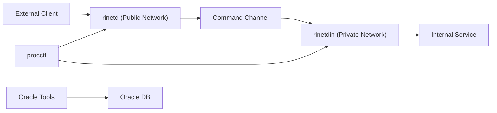

# IDC C++ Data Platform Toolkit

本仓库适合作为以下场景的学习与工程参考：

- Linux 网络编程（`socket`、`epoll`、`timerfd`、非阻塞 I/O）
- C++ 服务端基础组件封装（日志、文件、时间、字符串、TCP/FTP）
- 基于 Oracle 的数据抽取、清洗、入库流程
- 数据平台任务编排与进程守护

## Features

- 公共库：`public/_public.*`（字符串、时间、文件、日志、网络等）
- FTP 组件：`public/_ftp.*` + `ftplib`
- Oracle 封装：`public/db/oracle/_ooci.*`（OCI）
- 任务调度器：`tools/cpp/procctl.cpp`
- 反向代理：`tools/cpp/rinetd.cpp` + `tools/cpp/rinetdin.cpp`
- 多种数据工具：`xmltodb`、`dminingoracle`、`deletetable`、`migratetable` 等

## Repository Structure

```text
project/
├─ public/                 # 公共基础库（lib_public/libftp）与示例
│  ├─ db/oracle/           # Oracle 封装                           
├─ tools/
│  ├─ cpp/                 # 工具源码（代理、调度、传输、入库等）
│  └─ bin/                 # 编译产物目录
└─ idc/
   ├─ cpp/                 # IDC 业务程序源码
   ├─ bin/                 # 编译产物目录
   ├─ ini/                 # 配置文件
   └─ sql/                 # SQL 脚本
```

## Architecture (High Level)



## Environment Requirements

- OS: Linux (推荐 CentOS / Ubuntu)
- Compiler: `g++` / `gcc`
- Build: `make`
- Optional:
- Oracle Client/SDK（编译 Oracle 相关模块时需要）
- FTP 服务环境（测试 FTP 工具时需要）

## Build

> 当前 Makefile 采用 Linux 路径约定（如 `/project/public/...`），建议在 Linux 环境下构建并保持目录结构一致。

### 1) Build public libraries

```bash
cd public
make
```

### 2) Build tool executables

```bash
cd tools/cpp
make
```

### 3) Build IDC executables

```bash
cd idc/cpp
make
```

### 4) Oracle environment (optional)

编译依赖 Oracle 的程序前，请确保 `ORACLE_HOME` 已设置，例如：

```bash
export ORACLE_HOME=/path/to/oracle
```

## Quick Start

### A. Process scheduler (`procctl`)

```bash
./procctl <interval_seconds> <program> [args...]
```

示例：

```bash
/project/tools/bin/procctl 60 /project/idc/bin/crtsurfdata /project/idc/ini/stcode.ini /tmp/idc/surfdata /log/idc/crtsurfdata.log csv,xml,json
```

### B. Reverse proxy (`rinetd` + `rinetdin`)

1. 准备路由配置文件（示例：`/tmp/rinetd.conf`）：

```conf
# srcport  dstip          dstport
18080      127.0.0.1      8080
```

2. 在公网机启动 `rinetd`：

```bash
/project/tools/bin/rinetd /tmp/rinetd.log /tmp/rinetd.conf 5001
```

3. 在内网机启动 `rinetdin`：

```bash
/project/tools/bin/rinetdin /tmp/rinetdin.log <public_ip> 5001
```

4. 访问公网机 `18080`，流量将被转发至内网目标服务 `127.0.0.1:8080`。

## Key Modules

| Module | Path | Description |
|---|---|---|
| Public Library | `public/_public.h` | 通用字符串、时间、文件、日志、TCP 等工具 |
| FTP Library | `public/_ftp.h` | FTP 客户端能力 |
| Oracle Wrapper | `public/db/oracle/_ooci.h` | Oracle OCI C++ 封装 |
| Scheduler | `tools/cpp/procctl.cpp` | 周期调度与守护 |
| Reverse Proxy (Public) | `tools/cpp/rinetd.cpp` | 外网监听与转发 |
| Reverse Proxy (Private) | `tools/cpp/rinetdin.cpp` | 内网回连与转发 |